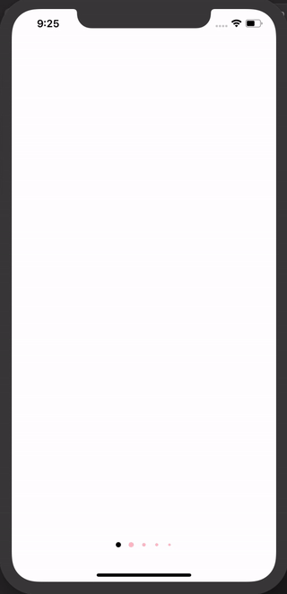

# react-native-animated-scroll-indicators
A package to display instagram-like animated scroll indicators on iOS as well as android.
Works with Animated.Scrollview and Animated.Flatlist.



## Installation
Using npm:
```
npm install --save react-native-animated-scroll-indicators
```
or using yarn:
```
yarn add react-native-animated-scroll-indicators
```

## Basic
| Prop           |     Default     |   Type   | Description                                                                                                 |
| :------------- | :-------------: | :------: | :---------------------------------------------------------------------------------------------------------- |
| scrollWidth     |      -       |  `Number`  | This is the width of pagination of scrollview. |
| numberOfCards   |      -       |  `Number`  | This number decides the number of dots which should be equivalent to the number of pages in the scrollview. |
| scrollAnimatedValue |    -    | `Animated.Value` | This animated value is the derived from onScroll event from scrollview|
| activeColor   |    '#8F9499'   |  `String`  | Color of the dot indicator when it is active. |
| inActiveColor |    '#fff'     |  `String`  | Color of the dot indicator when it is inactive. |

## Usage
```
import RNAnimatedScrollIndicators from 'react-native-animated-scroll-indicators';

  ...
  scrollX = new Animated.Value(0);

  render() {
    return (
      <SafeAreaView style={{ flex: 1 }}>
        <View style={{ flex: 1 }}>
          <Animated.ScrollView
            horizontal
            pagingEnabled
            showsHorizontalScrollIndicator={false}
            contentContainerStyle={{ flexGrow: 1 }}
            onScroll={Animated.event(
              [{ nativeEvent: { contentOffset: { x: this.scrollX } } }],
              { useNativeDriver: true })}
          >
            <View style={{ flex: 1, backgroundColor: 'white', width }} />
            <View style={{ flex: 1, backgroundColor: 'gray', width }} />
            <View style={{ flex: 1, backgroundColor: 'white', width }} />
            <View style={{ flex: 1, backgroundColor: 'gray', width }} />
            <View style={{ flex: 1, backgroundColor: 'white', width }} />
            <View style={{ flex: 1, backgroundColor: 'gray', width }} />
            <View style={{ flex: 1, backgroundColor: 'white', width }} />
          </Animated.ScrollView>
          <View style={{
            left: 0,
            right: 0,
            bottom: 0,
            zIndex: 100,
            marginBottom: 20,
            position: 'absolute'
          }}>
            <RNAnimatedScrollIndicators
              numberOfCards={7}
              scrollWidth={width}
              activeColor={'black'}
              inActiveColor={'pink'}
              scrollAnimatedValue={this.scrollX}
            />
          </View>
        </View>
      </SafeAreaView>
    );
  }
  ...
```
